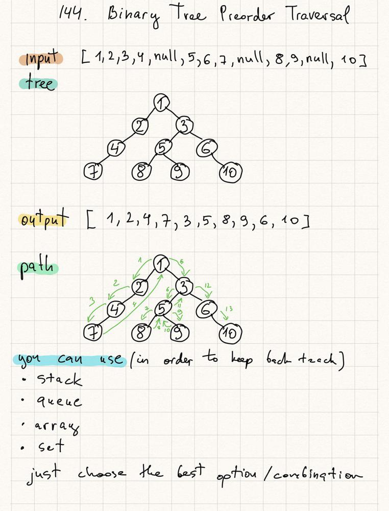

<<<<<<< HEAD
# 144. Binary Tree Preorder Traversal

Given the root of a binary tree, return the preorder traversal of its nodes' values.

```c
/**
 * Definition for a binary tree node.
 * struct TreeNode {
 *     int val;
 *     TreeNode *left;
 *     TreeNode *right;
 *     TreeNode() : val(0), left(nullptr), right(nullptr) {}
 *     TreeNode(int x) : val(x), left(nullptr), right(nullptr) {}
 *     TreeNode(int x, TreeNode *left, TreeNode *right) : val(x), left(left), right(right) {}
 * };
 */
class Solution {
public:
    vector<int> preorderTraversal(TreeNode* root) {
        vector<int> ans;
        stack<TreeNode *> s;
        TreeNode * curr = root;
        while(curr!=nullptr || !s.empty()) {
            while(curr != nullptr) {
                ans.push_back(curr -> val);
                s.push(curr);
                curr = curr -> left;
                
            } 
            curr = s.top();
            s.pop();
            curr = curr->right;
        }
        return ans;
    }
};
```

thêm 1 bài duyệt cây nữa
=======
# 144. Binary Tree Preorder Traversal

Given the root of a binary tree, return the preorder traversal of its nodes' values.

```c
/**
 * Definition for a binary tree node.
 * struct TreeNode {
 *     int val;
 *     TreeNode *left;
 *     TreeNode *right;
 *     TreeNode() : val(0), left(nullptr), right(nullptr) {}
 *     TreeNode(int x) : val(x), left(nullptr), right(nullptr) {}
 *     TreeNode(int x, TreeNode *left, TreeNode *right) : val(x), left(left), right(right) {}
 * };
 */
class Solution {
public:
    vector<int> preorderTraversal(TreeNode* root) {
        vector<int> ans;
        stack<TreeNode *> s;
        TreeNode * curr = root;
        while(curr!=nullptr || !s.empty()) {
            while(curr != nullptr) {
                ans.push_back(curr -> val);
                s.push(curr);
                curr = curr -> left;
                
            } 
            curr = s.top();
            s.pop();
            curr = curr->right;
        }
        return ans;
    }
};
```

thêm 1 bài duyệt cây nữa
>>>>>>> bad19b40af882feab18b89e58bb73dec7250f825
