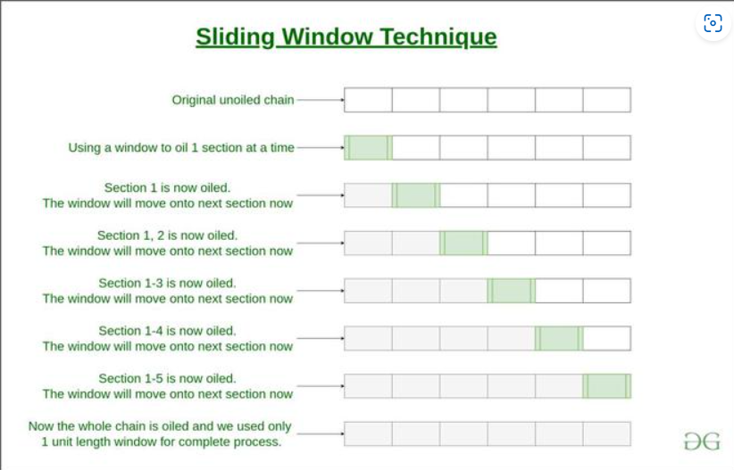
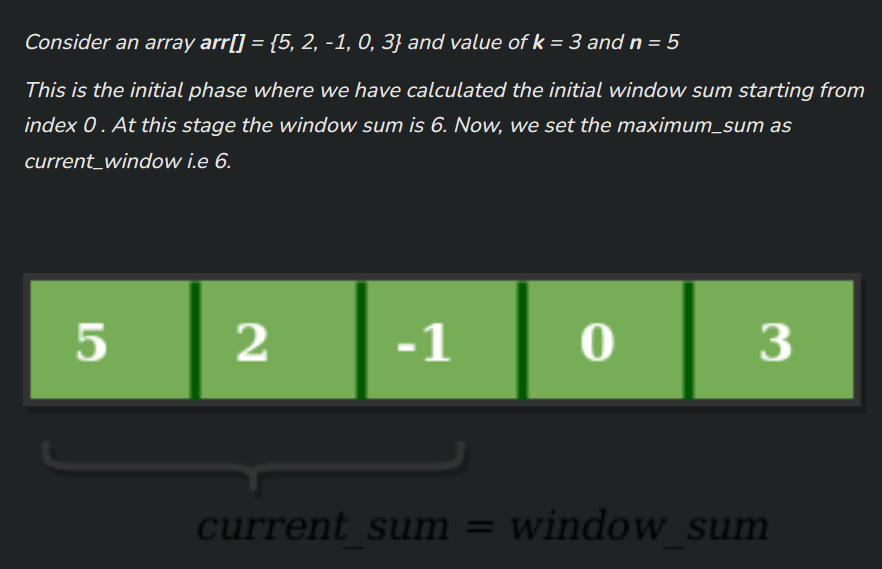
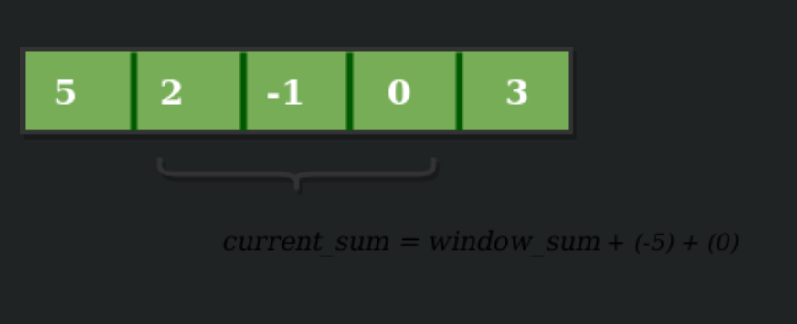
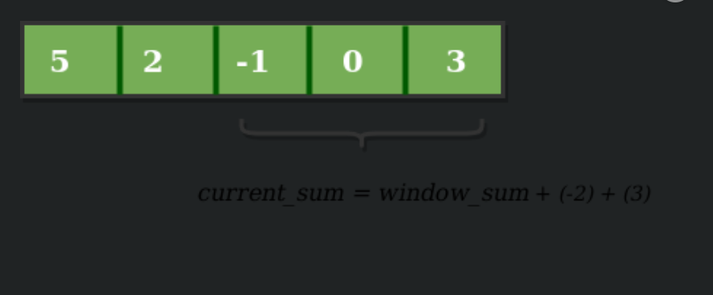

# Window sliding technique
**What is Window sliding technique**
Window Sliding Technique is a computational technique that aims to reduce the use of nested loops and replace it with a single loop, thereby reducing the time complexity
**What is Sliding Window**
Consider a long chain connected together. Suppose you want to apply oil in the complete chain with your hands, without pouring the oil from above.

One way to do so is to: 
- pick some oil, 
- apply onto a section of the chain, 
- then again pick some oil
- then apply it to the next section where oil is not applied yet
- and so on till the complete chain is oiled.

Another way to do so is to use a cloth, dip it in oil, and then hold onto one end of the chain with this cloth. Then instead of re-dipping it again and again, just slide the cloth with your hand onto the next section, and next, and so on till the other end.
The second way is known as the Sliding window technique and the portion which is slid from one end to end is known as Sliding Window.


**Prerequisite to use the Sliding window technique**
The use of the Sliding Window technique can be done in a very specific scenario, `where the size of the window for computation is fixed throughout the complete nested loop`. Only then the time complexity can be reduced. 

**How to use Sliding Window Technique?**
The general use of the Sliding window technique can be demonstrated as follows:
- Find the size of the window required 
- Compute the result for 1st window, i.e. from the start of the data structure
- Then use a loop to slide the window by 1, and keep computing the result window by window.

**How to Know, Where we use the Sliding Window?**
`Array, String, Sub Array, Sub String, Largest Sum, Maximum Sum, Minimum Sum`

**Example**
Example: Given an array of integers of size ‘n’, Our aim is to calculate the maximum sum of ‘k’ consecutive elements in the array.
```
Input  : arr[] = {100, 200, 300, 400}, k = 2
Output : 700

Input  : arr[] = {1, 4, 2, 10, 23, 3, 1, 0, 20}, k = 4 
Output : 39
We get maximum sum by adding subarray {4, 2, 10, 23} of size 4.

Input  : arr[] = {2, 3}, k = 3
Output : Invalid
There is no subarray of size 3 as size of whole array is 2.
```

- We compute the sum of the first k elements out of n terms using a linear loop and store the sum in variable window_sum.
- Then we will graze linearly over the array till it reaches the end and simultaneously keep track of the maximum sum.
- To get the current sum of a block of k elements just subtract the first element from the previous block and add the last element of the current block.

The below representation will make it clear how the window slides over the array.

Now, we slide our window by a unit index. Therefore, now it discards 5 from the window and adds 0 to the window. Hence, we will get our new window sum by subtracting 5 and then adding 0 to it. So, our window sum now becomes 1. Now, we will compare this window sum with the maximum_sum. As it is smaller, we wont change the maximum_sum. 

Similarly, now once again we slide our window by a unit index and obtain the new window sum to be 2. Again we check if this current window sum is greater than the maximum_sum till now. Once, again it is smaller so we don’t change the maximum_sum.
Therefore, for the above array our maximum_sum is 6.

Below is the code for above approach:
***C++***
```C++
// O(n) solution for finding maximum sum of
// a subarray of size k
#include <iostream>
using namespace std;

// Returns maximum sum in a subarray of size k.
int maxSum(int arr[], int n, int k)
{
	// n must be greater
	if (n < k) {
		cout << "Invalid";
		return -1;
	}

	// Compute sum of first window of size k
	int max_sum = 0;
	for (int i = 0; i < k; i++)
		max_sum += arr[i];

	// Compute sums of remaining windows by
	// removing first element of previous
	// window and adding last element of
	// current window.
	int window_sum = max_sum;
	for (int i = k; i < n; i++) {
		window_sum += arr[i] - arr[i - k];
		max_sum = max(max_sum, window_sum);
	}

	return max_sum;
}

// Driver code
int main()
{
	int arr[] = { 1, 4, 2, 10, 2, 3, 1, 0, 20 };
	int k = 4;
	int n = sizeof(arr) / sizeof(arr[0]);
	cout << maxSum(arr, n, k);
	return 0;
}
```

***Python3***
```py
# O(n) solution for finding
# maximum sum of a subarray of size k


def maxSum(arr, k):
	# length of the array
	n = len(arr)

	# n must be greater than k
	if n < k:
		print("Invalid")
		return -1

	# Compute sum of first window of size k
	window_sum = sum(arr[:k])

	# first sum available
	max_sum = window_sum

	# Compute the sums of remaining windows by
	# removing first element of previous
	# window and adding last element of
	# the current window.
	for i in range(n - k):
		window_sum = window_sum - arr[i] + arr[i + k]
		max_sum = max(window_sum, max_sum)

	return max_sum


# Driver code
arr = [1, 4, 2, 10, 2, 3, 1, 0, 20]
k = 4
print(maxSum(arr, k))

# This code is contributed by Kyle McClay
```

# Reference
- https://www.geeksforgeeks.org/window-sliding-technique/