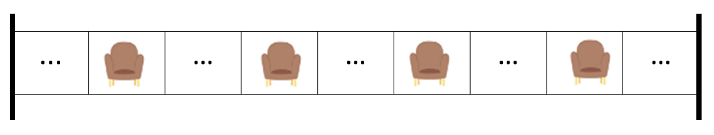
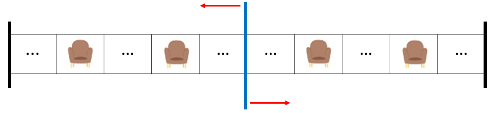
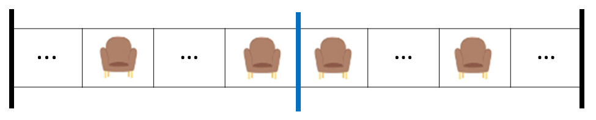
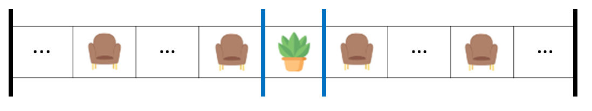
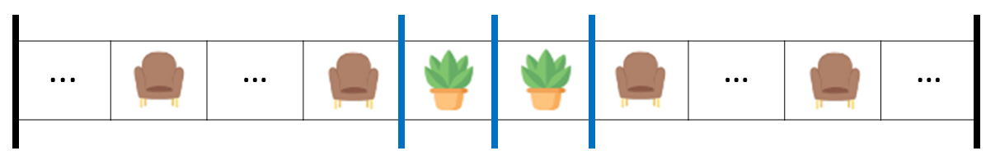

# Solutions
# Overview
Trong bài toán này, chúng ta phải chia hành lang chứa chỗ ngồi (biểu thị bởi S) và thực vật (biểu thị bởi P).
Việc phân chia phải tạo ra các phần không chồng chéo sao cho mỗi phần chứa chính xác hai chữ S. Không có hạn chế về số lượng P trong mỗi phần, điều này mang lại sự linh hoạt trong việc dịch chuyển dải phân cách.
Chúng ta phải đếm số cách chia hành lang, sau đó trả về số modulo 1000000007. Hơn nữa, nếu không có cách nào để phân chia hành lang, chúng ta nên trả về 0.
Hãy thử lọc ra những trường hợp không thể thực hiện được nhiệm vụ, dựa trên số S và P trong hành lang.
- nếu chúng ta có 0 chỗ thì không thể chia hành lang được, vì không có đoạn nào chứa đúng hai chữ S.
- nếu chúng ta chỉ có 1 chỗ ngồi thì không thể chia hành lang được, vì không có khu vực nào có thể chứa đúng hai chữ S. 
- nếu chỉ có 2 chỗ ngồi thì chỉ theo một cách thôi, là không chia cái gì cả
- nếu chỉ có 3 chỗ ngồi thì không thể chia hành lang được, vì không có sự phân chia nào mà mỗi khu vực có đúng hai chữ S. Sẽ có ít nhất một khu vực chứa ít hơn hai chữ S
- Hãy xem xét thêm một trường hợp nữa trước khi khái quát hóa những quan sát trên. Nếu chúng ta có 4 chỗ thì có thể chia hành lang ra. Hãy tập trung vào hình minh họa để hiểu sự phân chia.

Chữ ... trong hình minh họa trên đại diện cho bất kỳ số P nào (kể cả 0) trong `corridor`.
Chúng ta chỉ có thể có một số chia giữa S thứ hai và thứ ba. Bây giờ, số cách chúng ta có được số chia này chắc chắn phụ thuộc vào số P giữa S thứ hai và thứ ba.

Tổng quát:
- Nếu có k P giữa S thứ hai và S thứ ba thì chúng ta có thể có k+1 cách lắp đặt bộ chia
- Nếu có cách chia `corridor` thì ở `corridor` sẽ có chỗ ngồi, số ghế sẽ chẵn
- Chúng ta cũng có thể nhấn mạnh rằng cặp ghế S đã cho là cố định (với điều kiện là có cách phân chia hành lang). Điều này có thể được minh họa như
  - the first S will always be paired with the second S
  - the third S will always be paired with the fourth S
  - and so on
- Chúng ta chỉ có thể lắp đặt một dải phân cách giữa hai S là "hàng xóm, nhưng không ghép nối" và các nhà máy ở giữa chúng mang lại sự linh hoạt trong việc lắp đặt dải phân cách theo nhiều cách khác nhau.
- 