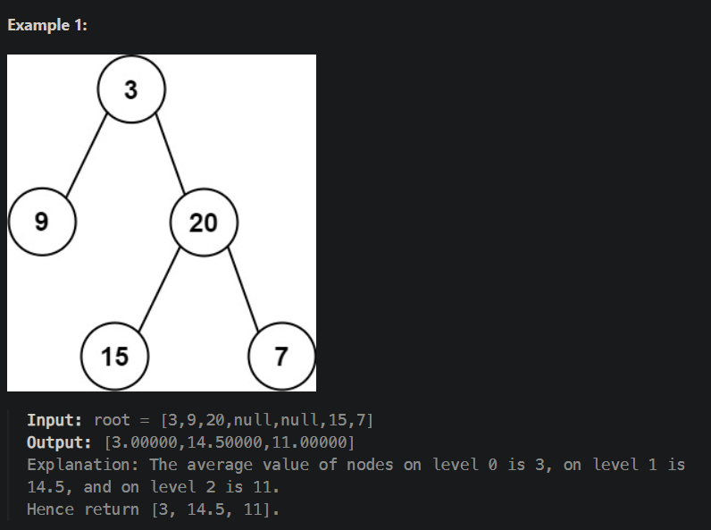
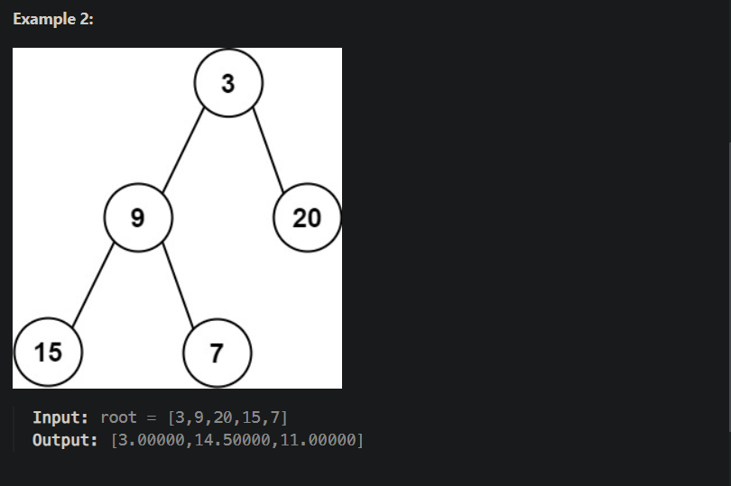

<<<<<<< HEAD
# 637. Average of Levels in Binary Tree
Given the root of a binary tree, return the average value of the nodes on each level in the form of an array. Answers within 10-5 of the actual answer will be accepted.

=======
# 637. Average of Levels in Binary Tree
Given the root of a binary tree, return the average value of the nodes on each level in the form of an array. Answers within 10-5 of the actual answer will be accepted.

>>>>>>> bad19b40af882feab18b89e58bb73dec7250f825
