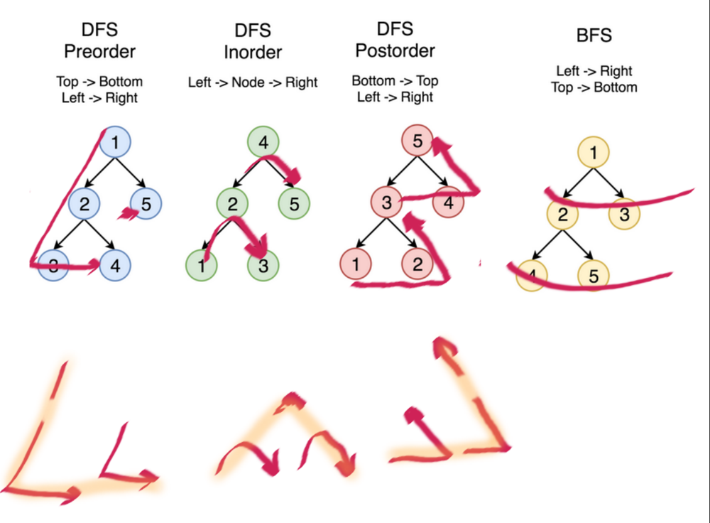
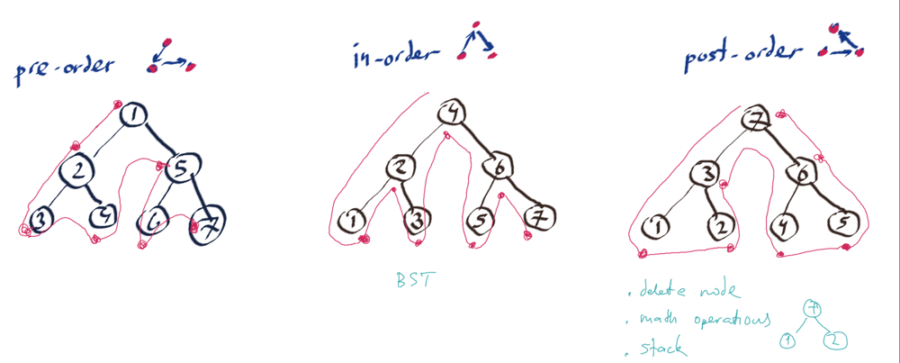

# 94. Binary Tree Inorder Traversal
Solution:

```C
class Solution {
public:
    vector<int> inorderTraversal(TreeNode* root) {
        vector<int> ans;
        stack<TreeNode*> s;
        TreeNode* current = root;

        while (current != nullptr || !s.empty()) {
            while (current != nullptr) {
                s.push(current);
                current = current->left;
            }

            current = s.top();
            s.pop();
            ans.push_back(current->val);
            current = current->right;
        }

        return ans;
    }
};
```

Ý tưởng thì hiểu, chỉ là quan trọng code lại như thế nào thôi.
Cơ bản là ta tạo ra một stack, sau đó duyệt hết tất cả các nút left vào bên trong stack đấy. Duyệt xong left rồi thì duyệt đến node rồi duyệt đến right.
Điều kiện lặp current khác null để đảm bảo ta đã duyệt đến cuối cùng của nhánh cây đấy rồi.

